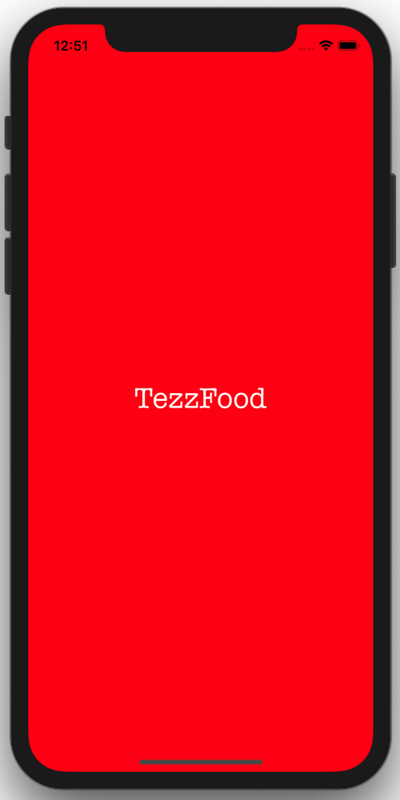
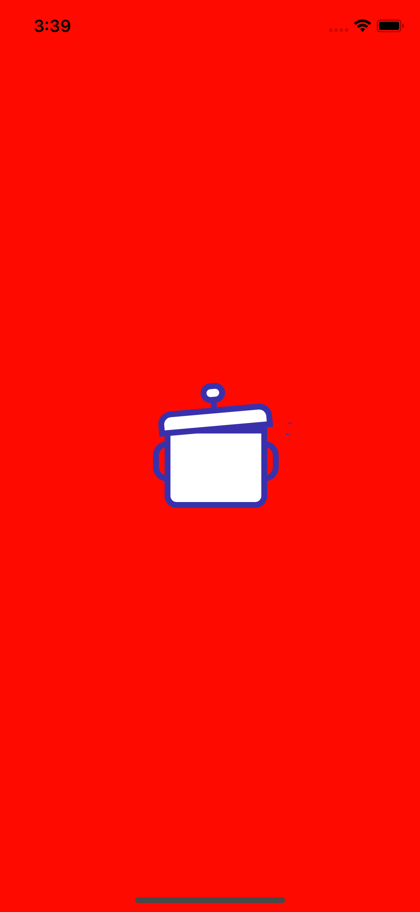
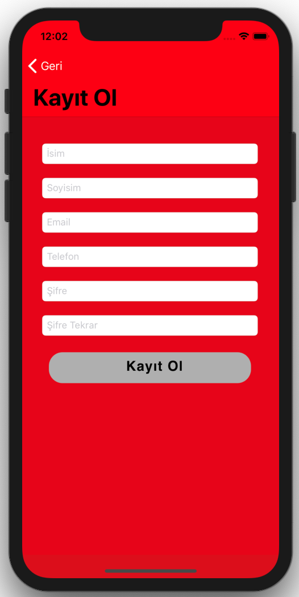
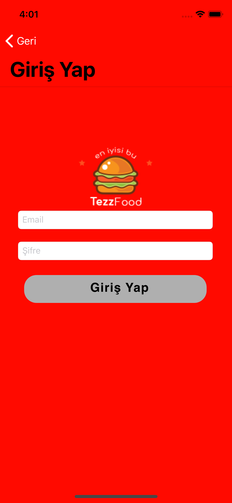
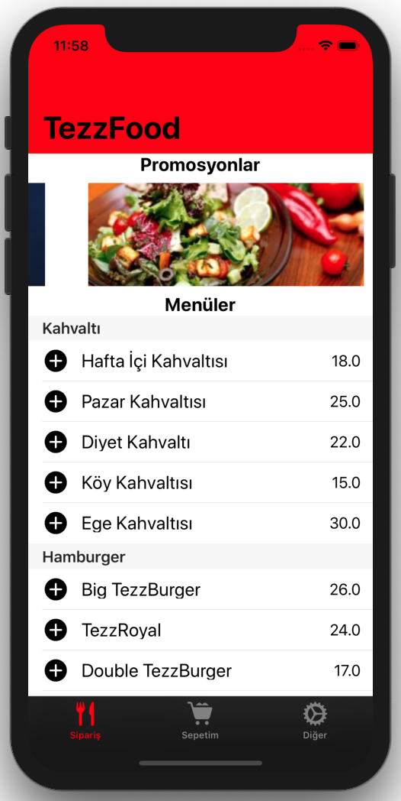
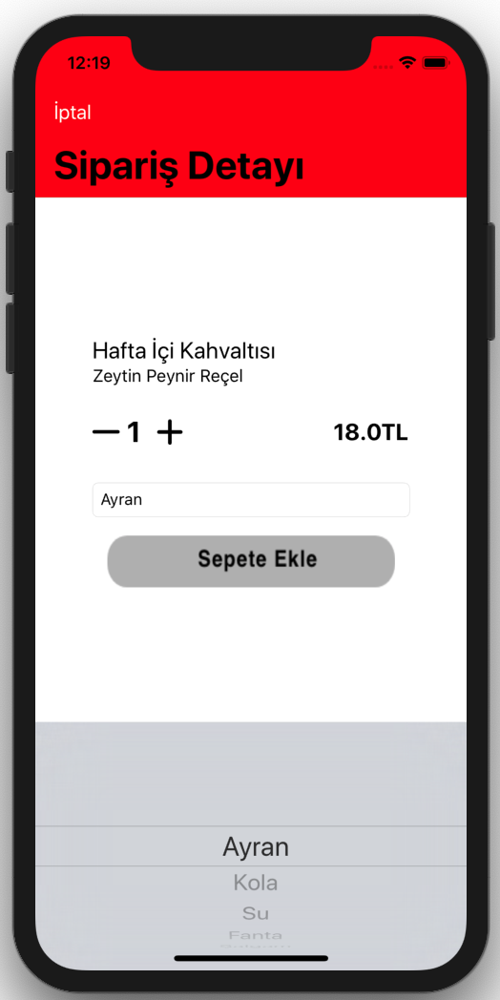
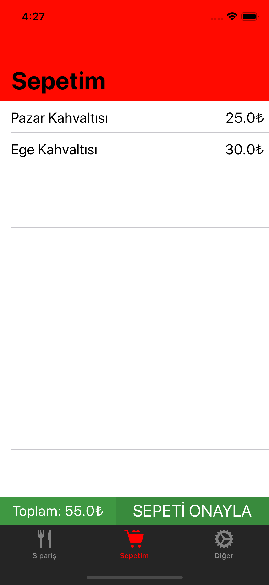
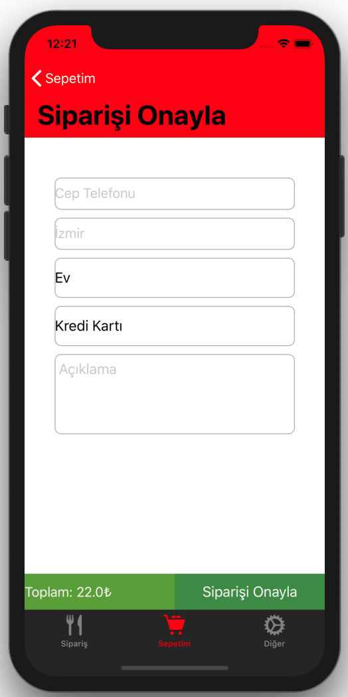
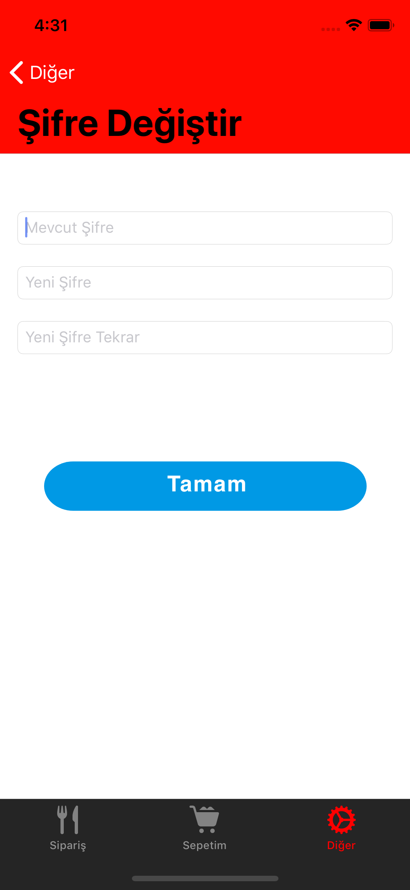

# Food

<h5>This native iOS project will be my graduate project as soon!</h5>
<h5>It will like Food Order application for custom restaurants.</h5>

<h3>Here are the screens</h3>

`Launch Screen`&nbsp;&nbsp;&nbsp;&nbsp;&nbsp;&nbsp;`Splash Screen` &nbsp;&nbsp;&nbsp;&nbsp;&nbsp;&nbsp;&nbsp;&nbsp;&nbsp;&nbsp;`First Screen` &nbsp;&nbsp;&nbsp;&nbsp;&nbsp;&nbsp;&nbsp;&nbsp;&nbsp;&nbsp;`Register Screen` &nbsp;&nbsp;&nbsp;&nbsp;&nbsp;&nbsp;&nbsp;&nbsp;`Login Screen`

  &nbsp; 
  &nbsp;
  &nbsp;
  &nbsp;
  &nbsp;
     

`Main Screen` &nbsp;&nbsp;&nbsp;&nbsp;&nbsp;&nbsp; `Detail Screen` 
&nbsp;&nbsp;&nbsp;&nbsp;&nbsp;&nbsp;&nbsp;&nbsp;&nbsp;&nbsp;&nbsp;&nbsp; `MyCart Screen` &nbsp;&nbsp;&nbsp;&nbsp;&nbsp;&nbsp;&nbsp;&nbsp;&nbsp;&nbsp;&nbsp;&nbsp; `Approve Order Screen`
&nbsp;&nbsp;&nbsp;&nbsp;&nbsp;&nbsp;&nbsp;&nbsp;`Other Screen` 

  &nbsp;
  &nbsp;
   &nbsp;
  &nbsp;
  &nbsp;
   
  

  
  `Change Password Screen` 
  

  &nbsp;
  

  
