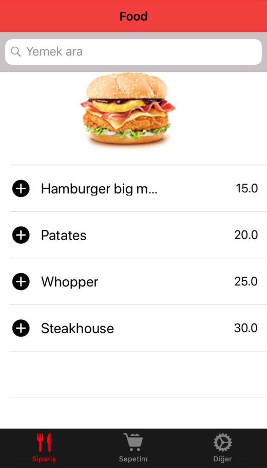
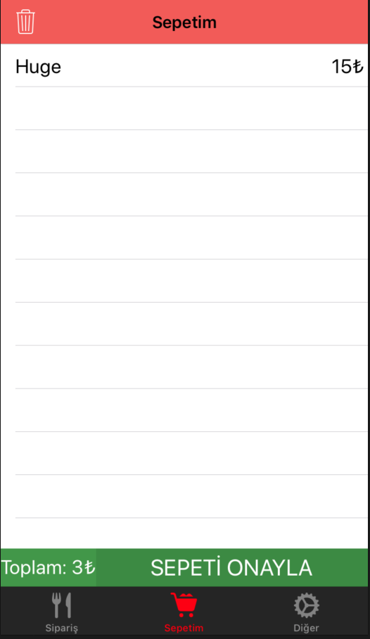
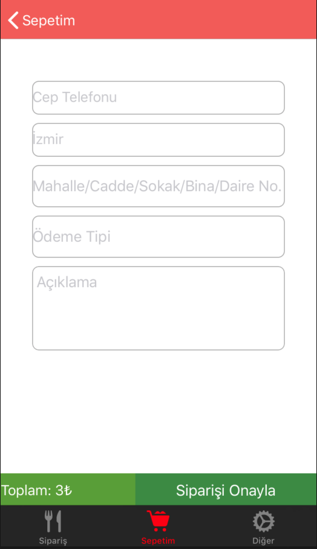

# Food

<h5>This native ios project will be my graduate project as soon!</h5>
<h5>It will like Food Order application for custom restaurants.</h5>

<h3>Here the screens</h3>

`Launch Screen` &nbsp;&nbsp;&nbsp;&nbsp;&nbsp;&nbsp; `Login Page` &nbsp;&nbsp;&nbsp;&nbsp;&nbsp;&nbsp;&nbsp;&nbsp;&nbsp;&nbsp;&nbsp;&nbsp; `Main Page` &nbsp;&nbsp;&nbsp;&nbsp;&nbsp;&nbsp;&nbsp;&nbsp;&nbsp;&nbsp;&nbsp;&nbsp;&nbsp; `Basket Page` &nbsp;&nbsp;&nbsp;&nbsp;&nbsp;&nbsp;&nbsp;&nbsp;&nbsp;&nbsp;&nbsp;  `Settings`

  &nbsp; 
  &nbsp;
  &nbsp;
  &nbsp;
  &nbsp;
     

Other screen

  
  &nbsp;
  &nbsp;
  
  

