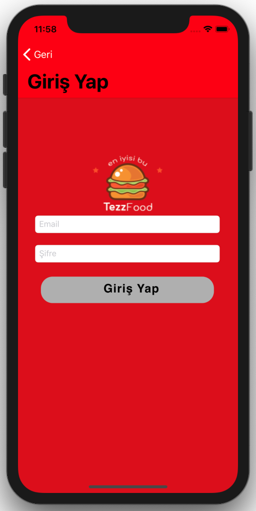

# FOOD DELIVERY APP  

#### WARNING!
---
Back-end services of this project were in my friend's company server. I tried to move back-end system to Firebase and Realm databases. Finally I made a local json file and fetched datas from there!!!
---

<h3>This native iOS project is my graduate project</h3>

  &nbsp; 
  &nbsp;
  &nbsp;
  &nbsp;
  &nbsp;
     

  &nbsp;
  &nbsp;
   &nbsp;
  &nbsp;
  &nbsp;
   
  

  
  

  &nbsp;
  
 

### ABOUT
Hungry? <b>TezzFood</b> is food delivery app that brings delicious food from your favourite local restaurant right to your door.  TezzFood makes local food delivery fast and easy! 

### HOW IT WORKS

First, sign up with e-mail and password then login.
Choose meals.
Place your order and pay via credit card or cash.
The resto will prepare your food, real-time tracking and once it’s ready, the courier will bring it to your doorstep.

### FEATURES
<ul>
<li>Select food from restaurant</li>
<li>Food delivery tracking</li>
<li>Credit card or cash payment</li>
<li>Email password login & Authentication</li>
<li>Synchrone with web project</li>
<li>Used <a href="https://github.com/onevcat/Kingfisher">Kingfisher</a> for downloading and caching images
<li>Used <a href="https://github.com/Moya/Moya">Moya</a> for network call
<li>Used <a href="https://github.com/airbnb/lottie-ios">Lottie</a> for UI animations
<li>Deployment target: iOS 11.2+</li>
<li>Supported devices: iPhone 5s, SE, 6, 6 Plus, 6s, 6s Plus, 7, 7 Plus, 8, 8 Plus, iPhone X </li>
</ul>

### REQUIREMENTS
<ul><li>Xcode 9.0+</li>
<li>iOS 9.3+</li>
</ul>
