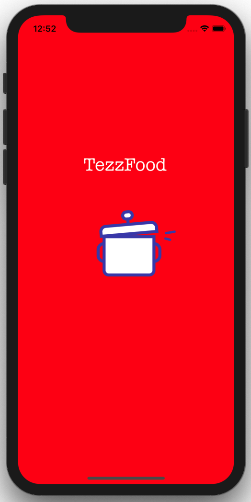

# Food

<h5>This native iOS project is my graduate project!</h5>
<h5>It will look like Food Order application for custom restaurants.</h5>

<h3>Here are the screens</h3>

  &nbsp; 
  &nbsp;
  &nbsp;
  &nbsp;
  &nbsp;
     

  &nbsp;
  &nbsp;
   &nbsp;
  &nbsp;
  &nbsp;
   
  

  
  

  &nbsp;
  

  
